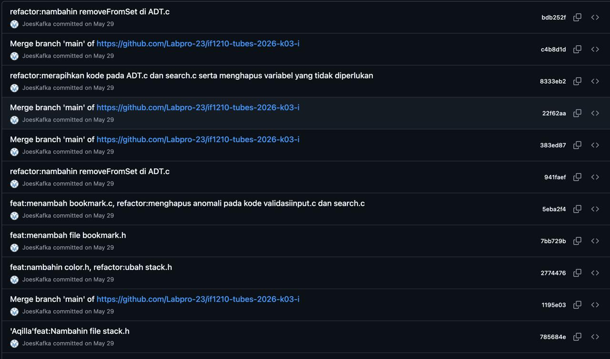

## Kompetensi target

Membedakan person, personality, dan character serta memilih objective, repertoire, dan language yang sesuai.

## Evidence wajib

- Lima character dari sedikitnya tiga domain kehidupan.
- Objective, responsibility, repertoire, dan risiko tiap character.
- Satu contoh perubahan language ketika character berubah.

::: {.callout-tip title="Lihat contoh pengisian"}
[Buka contoh fiktif Minggu 1](../examples/week-01.qmd) untuk melihat tingkat kekonkretan evidence dan analisis. Jangan menyalin contoh sebagai evidence pribadi.
:::

## Konteks performance

**Tanggal dan setting:** Performance ini berlangsung dalam satu rangkaian situasi pada 28–29 Mei 2026. Saya mengerjakan Tugas Besar Algoritma Pemrograman 1 pada 28 Mei pukul 21.00 sampai 29 Mei pukul 06.30, di tempat saya mengerjakan tugas dan berkomunikasi secara daring dengan kelompok. Deadline pengumpulan adalah pukul 07.00. Dampak dari performance ini berlanjut ketika saya menolak ikut perjalanan keluarga pukul 07.00 dan tetap mengikuti Welcoming Party Explorer GDGoC pukul 13.00 meskipun belum tidur.

**Persons dan relationship:** Pihak yang terlibat adalah diri saya sendiri, satu keluarga, teman dekat yang mengajak bermain game online, empat teman satu kelompok, dan komunitas Explorer GDGoC. Nama dan data pribadi tidak dicantumkan karena tidak diperlukan untuk analisis.

**Objective dan initial state:** Objective utama saya adalah menuntaskan tubes sebelum deadline, memahami bagian program yang dikerjakan, memastikan perubahan kode kelompok tidak saling menimpa, serta menyelesaikan laporan. Initial state saya adalah tugas belum sepenuhnya selesai, waktu tersisa sampai pukul 07.00, kelompok masih membutuhkan koordinasi, dan saya harus membagi perhatian antara coding, Git, laporan, serta komunikasi dengan orang di sekitar. State yang ingin dicapai adalah program berjalan dengan baik, perubahan tercatat rapi, laporan terisi, dan tugas terkumpul sebelum deadline.

## Lima character

| Domain dan character | Person & relationship | Objective & responsibility | Repertoire & language | Risiko dan latihan |
|---|---|---|---|---|
| Intra-self — mahasiswa yang tekun dan problem-solver | Diri saya sendiri sebagai mahasiswa yang bertanggung jawab terhadap hasil belajar dan deadline. | Menuntaskan tubes sebelum pukul 07.00 dan memahami alasan di balik solusi, bukan hanya membuat program selesai. Responsibility saya adalah mengatur waktu, menjaga fokus, dan memeriksa hasil kerja sendiri. | Saya memecah masalah menjadi bagian kecil, membaca error, menguji perubahan, dan berbicara kepada diri sendiri secara faktual: “Bagian mana yang belum berjalan dan bukti apa yang saya punya?” | Kelelahan dapat membuat saya melewatkan error atau hanya mengejar selesai. Latihannya adalah membuat prioritas, menguji fungsi utama, dan mencatat bagian yang belum dipahami untuk dipelajari setelah deadline. |
| Family — anggota keluarga yang memprioritaskan tanggung jawab akademik | Satu keluarga yang hendak melakukan perjalanan keluar kota pukul 07.00; hubungan saya dengan mereka adalah anggota keluarga. | Menyelesaikan tubes lebih dahulu dan menyampaikan bahwa saya tidak dapat ikut perjalanan karena perlu memulihkan kondisi setelah bekerja semalaman. Responsibility saya adalah menyampaikan penolakan dengan hormat dan tidak membuat keluarga menunggu tanpa kepastian. | Saya menggunakan bahasa langsung tetapi sopan, misalnya: “Saya tidak ikut dulu karena baru menyelesaikan tubes dan perlu tidur. Silakan berangkat sesuai rencana.” | Keluarga dapat menganggap saya tidak memprioritaskan kebersamaan. Latihannya adalah memberi tahu lebih awal, menjelaskan kondisi tanpa menyalahkan siapa pun, dan mengatur waktu untuk tetap berkomunikasi dengan keluarga. |
| Friends — teman yang menjaga fokus pada prioritas | Teman dekat yang mengajak saya bermain game online; hubungan kami dekat dan informal. | Menolak ajakan untuk sementara agar fokus pada tubes, sambil menjaga hubungan pertemanan. Responsibility saya adalah memberi jawaban yang jelas dan tidak menghilang tanpa penjelasan. | Saya memakai bahasa santai dan singkat: “Aku belum bisa ikut main karena sedang mengejar deadline tubes. Nanti setelah selesai kita atur waktu lagi.” | Teman dapat merasa ditolak atau saya kehilangan fokus jika membalas terlalu lama. Latihannya adalah menyampaikan batas waktu dengan jelas dan tidak membuka aktivitas game sebelum pekerjaan utama selesai. |
| Academic — anggota kelompok dan pengelola Git | Empat teman satu kelompok yang bersama-sama mengerjakan program dan laporan. Saya bertanggung jawab pada bagian Git dan berkoordinasi dengan anggota kelompok. | Membantu program berjalan baik, memastikan perubahan teman tercatat melalui commit, mengurangi risiko konflik atau perubahan yang collapse, dan membantu laporan selesai. | Saya menggunakan bahasa terstruktur: meminta anggota menjelaskan perubahan, mengingatkan untuk pull atau memberi kabar sebelum perubahan besar, lalu menulis pesan commit yang menjelaskan isi perubahan. | Kelelahan, commit yang tidak jelas, atau perubahan bersamaan dapat menimbulkan conflict dan kehilangan pekerjaan. Latihannya adalah membuat commit kecil dan teratur, memeriksa status atau diff, serta mengonfirmasi perubahan sebelum merge atau penggabungan. |
| Community — explorer yang tetap hadir dan berpartisipasi | Anggota Explorer GDGoC pada Welcoming Party pukul 13.00; hubungan saya adalah peserta baru/anggota komunitas dengan peserta dan pengurus lainnya. | Tetap hadir, menyimak, dan mengenal komunitas meskipun mengantuk setelah tidak tidur semalaman. Responsibility saya adalah menjaga sikap hormat, mengikuti kegiatan, dan berpartisipasi aktif sesuai kemampuan. | Saya menggunakan bahasa yang sopan dan terbuka, menyimak penjelasan, merespons ketika diperlukan, serta mengajukan atau menjawab pertanyaan dengan fokus. | Kurang tidur dapat membuat saya pasif, kehilangan informasi, atau tidak mampu mengikuti kegiatan. Latihannya adalah mengatur pemulihan setelah event, mencatat poin penting, dan mengenali batas fisik agar partisipasi tetap sehat. |

## Evidence

::: {.evidence-block}
{width=85%}
:::

## Analisis komunikasi

| Elemen | Evidence dan analisis |
|---|---|
| Person & character | Saya adalah satu person yang menampilkan beberapa character sesuai relationship dan responsibility. Dalam pengerjaan tubes saya menjadi mahasiswa yang tekun sekaligus pengelola Git; dalam keluarga saya menjadi anggota keluarga yang menetapkan batas; kepada teman saya menjadi teman yang memprioritaskan deadline; dan di GDGoC saya menjadi anggota komunitas yang tetap berpartisipasi. Character tersebut bukan kepribadian yang selalu sama, melainkan cara saya bertindak dalam konteks tertentu. |
| Objective & state | Kondisi awalnya adalah tubes dan laporan belum selesai, waktu tersisa sampai pukul 07.00, dan perubahan dari empat anggota kelompok harus dikelola. Objective saya adalah menyelesaikan tugas dengan program yang berjalan, laporan yang cukup, dan perubahan kode yang tercatat. Setelah tubes selesai, objective bergeser menjadi menjaga kondisi diri dan tetap memenuhi komitmen sosial secara terbatas: menolak perjalanan keluarga dan ajakan bermain, lalu menghadiri Welcoming Party pukul 13.00. |
| Repertoire & language | Repertoire saya berubah sesuai kebutuhan: debugging dan pemecahan masalah untuk diri sendiri, instruksi dan konfirmasi teknis untuk kelompok, bahasa santai saat menolak teman, bahasa hormat saat berbicara dengan keluarga, dan bahasa terbuka serta menyimak saat mengikuti komunitas. Perubahan nada dan pilihan kata menunjukkan perubahan character dan relationship, bukan perubahan objective utama untuk bertindak bertanggung jawab. |
| Response & adaptation | Ketika deadline semakin dekat, saya mempertahankan fokus dan menolak aktivitas yang dapat mengganggu. Setelah tugas selesai, saya menyesuaikan diri dengan kondisi lelah: tidak ikut perjalanan keluarga, tetapi tetap hadir di kegiatan komunitas pada siang hari dengan menyimak dan berpartisipasi. Adaptasi ini menunjukkan bahwa saya membedakan prioritas akademik, kebutuhan pemulihan, dan komitmen komunitas. |
| Agreement/action | Action utama adalah pengerjaan program, commit perubahan anggota kelompok, penyelesaian laporan, dan pengumpulan sebelum pukul 07.00. Action sosialnya adalah memberi tahu keluarga bahwa saya tidak ikut perjalanan dan memberi tahu teman bahwa saya belum bisa bermain. Pada kegiatan GDGoC, action saya adalah hadir, menyimak, dan berpartisipasi aktif. Detail agreement kelompok perlu didukung oleh chat atau riwayat Git. |
| Relationship outcome | Dengan kelompok, pengelolaan Git membantu perubahan lebih tertata dan mengurangi risiko pekerjaan collapse. Dengan keluarga dan teman, penolakan disampaikan untuk menjaga fokus dan kondisi tubuh, tetapi dapat menimbulkan kekecewaan sehingga perlu diikuti komunikasi yang baik. Dengan komunitas GDGoC, kehadiran dan partisipasi membantu saya tetap terhubung meskipun kondisi fisik kurang ideal. |

## Perubahan language

[Salah satu syarat penting di minggu ini adalah menunjukkan bahwa bahasa Anda berbeda sesuai dengan character.]

Contoh pola:
- Sebagai **diri sendiri**, saya berkata, “Saya selesaikan bagian yang paling penting dulu, lalu saya uji dengan contoh yang tersedia.”
- Sebagai **anggota tim dan pengelola Git**, saya berkata, “Tolong beri kabar sebelum mengubah bagian ini. Setelah itu kirim perubahan agar saya commit dan kita bisa mengecek apakah program tetap berjalan.”
- Sebagai **teman**, saya berkata, “Aku belum bisa ikut main karena sedang fokus menyelesaikan tubes. Nanti kita cari waktu lain.”
- Sebagai **anggota keluarga**, saya berkata, “Saya tidak ikut perjalanan kali ini karena baru selesai mengerjakan tubes dan perlu tidur. Hati-hati di jalan.”
- Sebagai **anggota komunitas**, saya menggunakan bahasa yang lebih formal dan terbuka ketika menyimak atau merespons materi Welcoming Party.

Tujuan dasarnya tetap sama, yaitu bertindak bertanggung jawab terhadap tugas dan hubungan, tetapi cara saya menyampaikan pesan, pilihan kata, tingkat formalitas, dan fokus tindakan berubah sesuai dengan character, responsibility, dan relationship.

## Penggunaan AI

AI digunakan untuk membantu menyusun pengalaman ini ke dalam format portfolio; fakta utama berasal dari pengalaman dan penjelasan saya sendiri. Saya tetap bertanggung jawab untuk:

- memeriksa kembali tanggal, jam, deadline, urutan kejadian, dan kontribusi Git;
- mengganti atau menghapus kalimat yang tidak sesuai dengan pengalaman sebenarnya;
- tidak memasukkan nama atau data pribadi anggota keluarga, teman, dan kelompok;
- menambahkan evidence asli sebelum menjadikan tulisan ini sebagai submission;
- memahami sendiri perbedaan person, character, objective, repertoire, language, response, dan relationship outcome.

## Feedback dan tindak lanjut

**Feedback yang diterima:** Belum ada kutipan observer yang dilampirkan. Feedback sementara yang dapat diperiksa dari event ini adalah bahwa fokus dan pengelolaan Git membantu penyelesaian tubes, tetapi keputusan tetap mengikuti kegiatan komunitas setelah tidak tidur semalaman menunjukkan perlunya mengelola batas fisik dengan lebih baik.

**Adaptation/replay:** Dalam replay, saya akan membuat pembagian kerja dan aturan pengiriman perubahan Git lebih eksplisit sejak awal. Saya juga akan menyampaikan kepada keluarga, teman, dan komunitas bahwa saya sedang memiliki deadline serta menentukan waktu pemulihan setelahnya. Response yang diharapkan adalah lebih sedikit interupsi, lebih jelasnya status pekerjaan, dan partisipasi komunitas yang tidak mengorbankan kesehatan.

**Next practice:** Pada tugas kelompok berikutnya, saya akan membuat checkpoint Git dan ringkasan status pada beberapa titik sebelum deadline, kemudian menetapkan waktu berhenti agar saya tidak perlu mengikuti kegiatan berikutnya dalam kondisi kurang tidur.

## Self-assessment

| Dimensi | Skor 1–4 | Evidence singkat |
|---|---:|---|
| Person & Character | 4 | Lima character dari lima domain sudah dibedakan berdasarkan relationship dan responsibility. |
| Objective & State | 4 | Deadline, kondisi awal, target program/laporan, dan perubahan prioritas setelah deadline sudah dijelaskan. |
| Repertoire, Language & AI | 3 | Pilihan bahasa untuk diri sendiri, kelompok, keluarga, teman, dan komunitas sudah dibedakan; penggunaan AI sudah dinyatakan. |
| Response & Adaptation | 3 | Respons terhadap deadline, ajakan teman, perjalanan keluarga, dan rasa lelah sudah dianalisis. |
| Agreement, Action & Relationship | 3 | Action sudah dijelaskan, tetapi skor dapat dinaikkan setelah chat kelompok, bukti commit, dan feedback pihak lain dilampirkan. |

**Total sementara:** 17 / 20

::: {.assessor-only}
### Assessment dosen

**Skor:** — / 20  
**Evidence yang mendukung:** —  
**Prioritas perbaikan:** —  
**Keputusan:** Belum dinilai / Perlu revisi / Tercapai
:::
