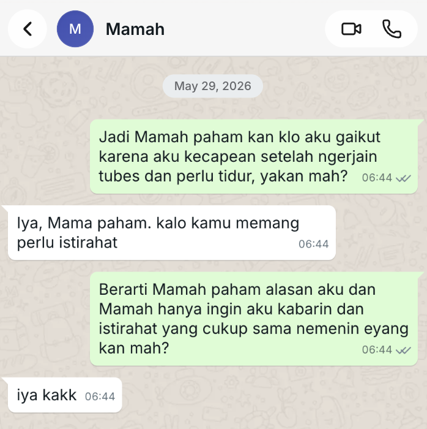
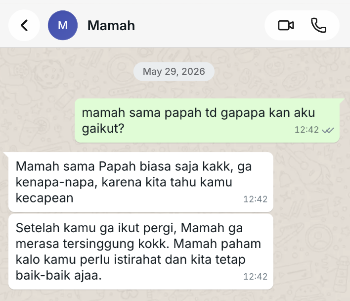

## Kompetensi target

Membedakan person, personality, dan character serta memilih objective, repertoire, dan language yang sesuai.

## Evidence wajib

- Lima character dari sedikitnya tiga domain kehidupan.
- Objective, responsibility, repertoire, dan risiko tiap character.
- Satu contoh perubahan language ketika character berubah.

## Konteks performance

**Tanggal dan setting:** Performance ini berlangsung pada 28–29 Mei 2026. Saya mengerjakan Tugas Besar Algoritma Pemrograman 1 pada 28 Mei pukul 21.00 sampai 29 Mei pukul 06.30, berkomunikasi secara daring dengan kelompok, dan menghadapi deadline pukul 07.00. Dampaknya berlanjut ketika saya menolak perjalanan keluarga pukul 07.00 dan tetap mengikuti Welcoming Party Explorer GDGoC pukul 13.00.

**Persons dan relationship:** Pihak yang terlibat adalah diri saya sendiri, keluarga, teman dekat yang mengajak bermain game, empat teman satu kelompok, dan komunitas Explorer GDGoC. Nama dan data pribadi tidak dicantumkan.

**Objective dan initial state:** Objective saya adalah menuntaskan tubes sebelum deadline, memahami bagian program, memastikan perubahan kode tidak saling menimpa, dan menyelesaikan laporan. Initial state: tugas belum selesai, waktu tersisa sampai pukul 07.00, kelompok membutuhkan koordinasi, dan perhatian terbagi antara coding, Git, laporan, serta komunikasi sosial.

## Lima character

| Domain dan character | Person & relationship | Objective & responsibility | Repertoire & language | Risiko dan latihan |
|---|---|---|---|---|
| Intra-self — mahasiswa tekun dan problem-solver | Diri saya sebagai mahasiswa yang bertanggung jawab terhadap hasil belajar dan deadline. | Menuntaskan tubes dan memahami solusi; mengatur waktu, fokus, serta memeriksa hasil. | Memecah masalah, membaca error, menguji perubahan, dan bertanya faktual: “Bagian mana yang belum berjalan dan bukti apa yang saya punya?” | Kelelahan dapat menurunkan ketelitian; saya perlu memprioritaskan fungsi utama dan mencatat hal yang dipelajari. |
| Family — anggota keluarga yang memprioritaskan tanggung jawab akademik | Keluarga yang hendak bepergian pukul 07.00. | Menyelesaikan tubes dan menyampaikan penolakan dengan hormat tanpa membuat keluarga menunggu. | “Saya tidak ikut perjalanan kali ini karena baru selesai mengerjakan tubes dan perlu tidur.” | Keluarga dapat kecewa; saya perlu memberi tahu lebih awal dan menjadwalkan komunikasi. |
| Friends — teman yang menjaga fokus pada prioritas | Teman dekat yang mengajak bermain game. | Menolak sementara agar fokus, tanpa menghilang tanpa penjelasan. | “Aku belum bisa ikut main karena sedang mengejar deadline tubes. Nanti kita atur waktu lagi.” | Teman dapat merasa ditolak; saya perlu menyampaikan batas waktu dengan jelas. |
| Academic — anggota kelompok dan pengelola Git | Empat teman satu kelompok; saya mengelola Git dan koordinasi. | Menjaga perubahan tercatat, mengurangi conflict, dan membantu laporan. | Meminta penjelasan perubahan, mengingatkan pull/push, serta menulis pesan commit yang jelas. | Commit tidak jelas atau perubahan bersamaan dapat menyebabkan conflict; saya perlu membuat commit kecil dan memeriksa diff. |
| Community — explorer yang tetap hadir dan berpartisipasi | Anggota Explorer GDGoC pada Welcoming Party pukul 13.00. | Hadir, menyimak, dan berpartisipasi sesuai kemampuan. | Bahasa sopan dan terbuka, menyimak, serta merespons ketika diperlukan. | Kurang tidur dapat menurunkan partisipasi; saya perlu mengenali batas fisik. |

## Evidence

::: {.evidence-block}
{width=85%}

**Artifact teknis:** Screenshot riwayat commit/merge pada repository tubes (terlampir di atas).

Screenshot memperlihatkan commit serta merge perubahan program pada 29 Mei 2026. Hash commit dapat digunakan untuk pencocokan jika repository dapat diakses kembali. Tautan repository yang tercantum pada screenshot saat ini tidak dapat diverifikasi (HTTP 404), sehingga screenshot adalah artifact teknis yang tersedia.

{width=85%}

Screenshot chat menunjukkan saya meminta anggota menguji program secara lokal, mengonfirmasi bahwa masalah sudah diperbaiki, dan menerima usulan penambahan algoritma. Artifact ini mendukung koordinasi teknis kelompok, tetapi belum membuktikan respons keluarga atau teman terhadap batas sosial saya.

{width=85%}

{width=85%}

Teman menerima penolakan saya dan mengusulkan waktu nongkrong lain. Mama menerima alasan saya tidak ikut perjalanan, menyarankan saya beristirahat dan menemani Eyang. Kedua screenshot ini memberi verifikasi eksternal bahwa batas sosial saya disampaikan dan diterima pada percakapan tersebut.
:::

## Analisis komunikasi

| Elemen | Evidence dan analisis |
|---|---|
| Person & character | Saya menampilkan character mahasiswa, pengelola Git, anggota keluarga, teman, dan anggota komunitas sesuai relationship dan responsibility. |
| Objective & state | Kondisi awal adalah tubes dan laporan belum selesai dengan waktu terbatas. Setelahnya tugas selesai, tetapi saya kurang tidur dan perlu pemulihan. |
| Repertoire & language | Saya menggunakan debugging untuk diri sendiri, instruksi teknis untuk kelompok, bahasa santai kepada teman, bahasa hormat kepada keluarga, dan bahasa terbuka di komunitas. |
| Response & adaptation | Saya fokus pada deadline, menolak aktivitas yang mengganggu, tidak ikut perjalanan, dan tetap hadir di kegiatan komunitas meski kondisi fisik kurang ideal. |
| Agreement/action | Commit, merge, penyelesaian program, laporan, serta screenshot chat sosial dan teknis mendukung tindakan akademik dan penerimaan batas sosial. |
| Relationship outcome | Teman menerima penolakan dan mengusulkan waktu lain. Berdasarkan pengamatan saya, perasaan keluarga setelah saya menyampaikan tidak ikut perjalanan tetap biasa saja karena kedua orang tua memahami saya sedang kelelahan setelah mengerjakan tubes. Dampak emosional jangka panjang pada hubungan keluarga tetap harmonis. |

## Feedback dan tindak lanjut

**Feedback yang diterima:** Balasan teman dan Mama pada screenshot menunjukkan pesan dipahami dan diterima. Berdasarkan pengamatan langsung saya, keluarga tidak menunjukkan kekecewaan emosional yang berlanjut; perasaan mereka tetap biasa saja karena memahami kondisi saya yang kelelahan. Hubungan keluarga setelah kejadian tetap harmonis.

**Batas evidence:** Pernyataan tentang perasaan keluarga dan hubungan yang tetap harmonis berasal dari pengamatan serta penilaian saya, bukan kutipan tertulis baru dari orang tua. Screenshot chat yang terlampir tetap menjadi bukti langsung bahwa batas disampaikan dan diterima.

**Adaptation/replay:** Pada tugas berikutnya saya akan membuat checkpoint Git, mengirim ringkasan status, menyampaikan batas lebih awal, dan menyimpan screenshot chat yang dianonimkan serta feedback dengan izin.

**Next practice:** Saya akan menetapkan waktu berhenti dan pemulihan agar partisipasi berikutnya tidak mengorbankan kesehatan.

**Catatan artifact relationship:** Screenshot chat teman dan Mama sudah dilampirkan di atas. Artifact tambahan dapat digunakan jika tersedia, tetapi tidak lagi diperlukan untuk memverifikasi respons langsung pada episode ini.

| Pihak | Pesan/batas yang disampaikan | Respons tertulis pihak lain | Waktu dan medium |
|---|---|---|---|
| Teman | Menolak ajakan nongkrong karena harus mengerjakan tubes. | “Oh yaudah deh kalau gitu, semangat ya. Next time kita nongkrong.” | 28 Mei 2026, WhatsApp, 21.41–21.43 |
| Mama | Menyampaikan tidak ikut perjalanan karena kelelahan setelah mengerjakan tugas semalaman. | Mama menyarankan saya tidur dan beristirahat di rumah sambil menemani Eyang. | 29 Mei 2026, WhatsApp, 06.41–06.43 |

{width=85%}

**Interpretasi emosional dan outcome jangka panjang:** Pada 29 Mei 2026 pukul 12.42, Mama menyatakan bahwa Mama dan Papah biasa saja, tidak tersinggung, memahami saya perlu istirahat, dan hubungan tetap baik. Ini merupakan bukti tertulis langsung untuk outcome emosional keluarga, bukan hanya pengamatan saya.

Screenshot lain pada pukul 06.44 juga menunjukkan bahwa Mama memahami alasan saya tidak ikut dan mengonfirmasi rangkuman saya. Screenshot ini memperkuat bukti bahwa keputusan tersebut dipahami dalam komunikasi keluarga.

{width=85%}

## Self-assessment

| Dimensi | Skor 1–4 | Evidence singkat |
|---|---:|---|
| Person & Character | 4 | Lima character dari lima domain dibedakan berdasarkan relationship dan responsibility. |
| Objective & State | 4 | Deadline, kondisi awal, target, dan perubahan prioritas dijelaskan. |
| Repertoire, Language & AI | 3 | Pilihan bahasa dibedakan sesuai konteks dan penggunaan AI dinyatakan. |
| Response & Adaptation | 3 | Respons terhadap deadline, ajakan, perjalanan, dan kelelahan dianalisis. |
| Agreement, Action & Relationship | 4 | Screenshot teman dan Mama memverifikasi bahwa batas disampaikan, dipahami, dan diterima pada percakapan tersebut. |

**Total sementara:** 17 / 20

::: {.assessor-only}
### Assessment dosen

**Skor:** — / 20  
**Evidence yang mendukung:** —  
**Prioritas perbaikan:** —  
**Keputusan:** Belum dinilai / Perlu revisi / Tercapai
:::
