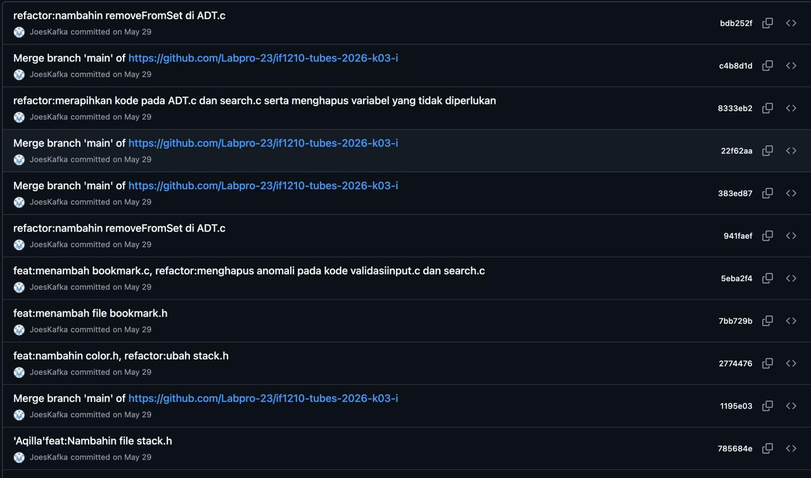
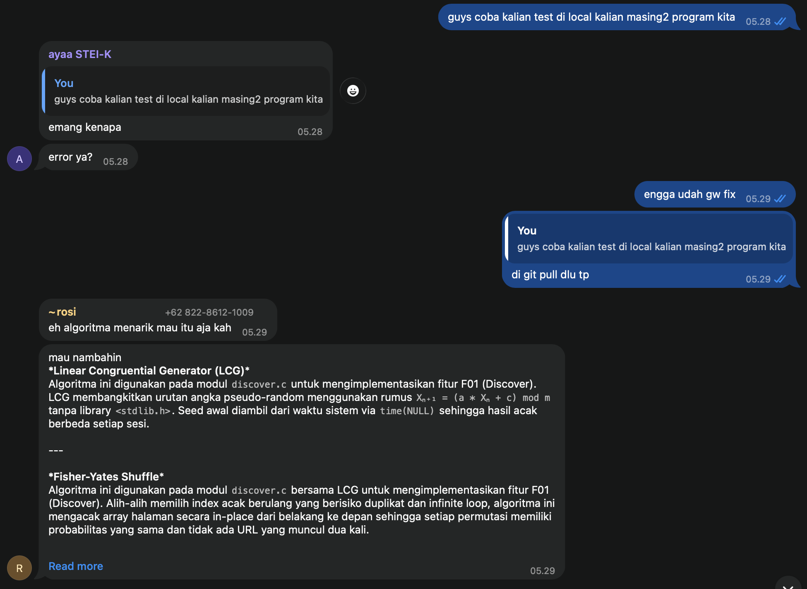
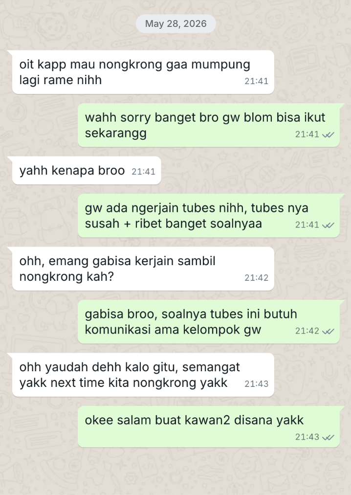
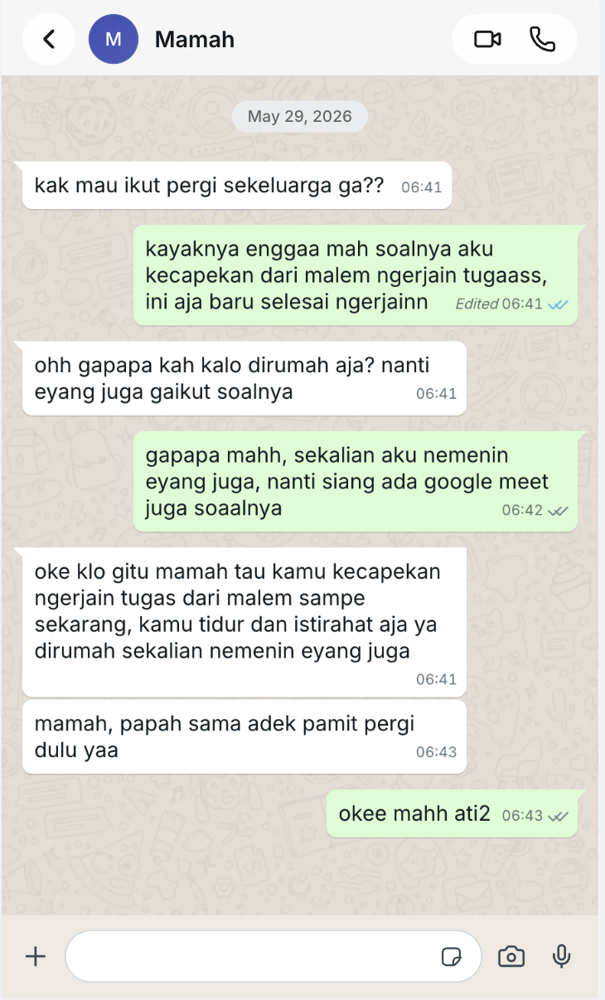

## Kompetensi target

Memisahkan event, fact, story, emotion, internal character, choice, dan action.

## Evidence wajib

- Satu episode komunikasi dengan diri sendiri.
- Initial story dan sedikitnya dua alternative narratives.
- Internal agreement dan bukti tindakan berikutnya.

::: {.callout-tip title="Lihat contoh pengisian"}
[Buka contoh fiktif Minggu 2](../examples/week-02.qmd) untuk melihat tingkat kekonkretan evidence dan analisis. Jangan menyalin contoh sebagai evidence pribadi.
:::

::: {.callout-note title="Cara mengisi portofolio ini"}
Pilih satu kejadian nyata ketika Anda mengalami reaksi spontan, lalu menunjukkan perubahan menuju respons yang lebih sadar. Ganti semua teks dalam tanda kurung siku `[seperti ini]` dengan pengalaman Anda sendiri. Jangan menulis identitas pribadi orang lain secara lengkap.

Gunakan urutan berikut:

1. Catat kejadian dan pisahkan fakta dari cerita yang muncul di pikiran.
2. Catat emosi, sinyal tubuh, dan kecenderungan diri yang muncul.
3. Buat sedikitnya dua penafsiran alternatif yang tetap sesuai fakta.
4. Tulis percakapan internal dan kesepakatan tindakan.
5. Lampirkan bukti tindakan, feedback, dan perubahan setelahnya.
6. Isi analisis, tindak lanjut, dan penilaian diri di bagian template umum.

Jangan mengarang bukti. Jika belum melakukan tindakannya, tulis rencana sementara dan ubah status portofolio menjadi `Sedang berjalan`.
:::

## Episode

**Tanggal dan waktu:** 28 Mei 2026 pukul 21.00 sampai 29 Mei 2026 pukul 06.30; dampaknya berlanjut pada pukul 07.00 dan 13.00.

**Setting:** Saya mengerjakan Tugas Besar Algoritma Pemrograman 1 di tempat saya mengerjakan tugas, berkoordinasi secara daring dengan kelompok, dan menghadapi deadline pukul 07.00.

**Orang yang terlibat:** Diri saya sendiri sebagai mahasiswa, empat teman satu kelompok, keluarga yang merencanakan perjalanan pukul 07.00, teman dekat yang mengajak bermain game, dan komunitas Explorer GDGoC. Episode ini berfokus pada komunikasi internal saya ketika harus memilih prioritas.

**Tujuan saya:** Menyelesaikan tubes dan laporan sebelum deadline, memahami bagian program yang saya kerjakan, menjaga perubahan Git tetap tertata, lalu mengambil keputusan sosial yang tidak mengganggu tanggung jawab akademik.

| Lapisan | Catatan Anda |
|---|---|
| **Event** | Saya mengerjakan tubes dan laporan sepanjang malam dengan waktu tersisa sampai pukul 07.00, sambil mengelola perubahan kode kelompok dan menerima ajakan bermain serta rencana perjalanan keluarga. |
| **Fact** | Tugas belum selesai pada awal episode; deadline pukul 07.00; empat anggota kelompok terlibat; saya mengerjakan program, commit perubahan, dan laporan; saya menolak bermain, tidak ikut perjalanan keluarga pukul 07.00, lalu hadir di Welcoming Party Explorer GDGoC pukul 13.00. |
| **Initial story** | “Saya takut jika kami mengumpulkannya lebih dari deadline yang diberikan.” Cerita ini merupakan kekhawatiran tentang kemungkinan terlambat, bukan fakta bahwa kelompok pasti gagal. |
| **Emotion/body signal** | Cemas 7/10, lelah 9/10, frustrasi 5/10, dan takut gagal 7/10. Sinyal tubuh yang saya rasakan adalah sangat mengantuk selama pengerjaan dan badan sangat lemas setelah menyelesaikan tugas pada pagi hari. |
| **Reactive character** | Mahasiswa yang tekun dan problem-solver, tetapi cenderung terus memaksa diri ketika deadline dekat. Label ini merupakan analisis dari tindakan, bukan identitas tetap. |
| **Desired character** | Mahasiswa yang bertanggung jawab sekaligus mampu mengatur batas fisik: menyelesaikan prioritas, berkomunikasi jelas, dan menjadwalkan pemulihan sebelum mengikuti kegiatan berikutnya. |

**Petunjuk:** Pastikan `Initial story` tidak disamakan dengan `Fact`. Kalimat “saya gagal total” biasanya merupakan interpretasi, bukan fakta.

## Alternative narratives

Tuliskan minimal dua kemungkinan penafsiran lain. Setiap narasi harus tetap masuk akal berdasarkan fakta dan membantu Anda memilih tindakan.

1. **Prioritas terukur:** Deadline memang pukul 07.00, sehingga menyelesaikan bagian paling penting dan mengelola Git adalah prioritas yang masuk akal; hal itu tidak berarti saya harus mengabaikan pemulihan setelahnya.
2. **Tanggung jawab bersama:** Tugas kelompok bukan hanya beban saya; koordinasi, commit kecil, dan komunikasi status dapat membagi tanggung jawab tanpa saya mengambil semua pekerjaan sendiri.
3. **Batas fisik:** Menghadiri kegiatan pukul 13.00 setelah tidak tidur semalaman memiliki risiko terhadap fokus dan kesehatan; keputusan yang lebih lengkap perlu mempertimbangkan waktu istirahat, bukan hanya keberhasilan menyelesaikan deadline.

**Narasi yang paling berguna:** Narasi “prioritas terukur” paling berguna karena sesuai dengan fakta deadline, kebutuhan kelompok, dan pekerjaan yang harus diselesaikan. Narasi ini membantu saya fokus pada fungsi utama, laporan, dan commit penting, lalu mengakui bahwa pemulihan fisik juga merupakan bagian dari tanggung jawab.

## Internal conversation dan agreement

>Tulis percakapan singkat antara kecenderungan reaktif, suara yang lebih reflektif, dan diri Anda sebagai pengambil keputusan.

> **Mahasiswa yang memaksa diri:** “Saya harus terus bekerja sampai semua selesai dan tidak boleh terganggu.”  
> **Mahasiswa yang bertanggung jawab:** “Fakta apa yang paling mendesak? Bagian program, commit, laporan, atau aktivitas lain?”  
> **Saya:** “Saya akan menyelesaikan fungsi utama, commit perubahan secara teratur, mengisi laporan yang wajib, menolak ajakan bermain, memberi tahu keluarga, lalu menilai kembali kondisi tubuh sebelum kegiatan siang.”

**Dua karakter yang berinteraksi:**

- **Karakter Reaktif — “Pengejar deadline”:** “Kalau saya berhenti atau membalas ajakan sekarang, tugas pasti terlambat. Saya harus terus bekerja sampai selesai, walaupun tubuh sudah sangat mengantuk.”
- **Karakter Reflektif — “Pengelola prioritas dan batas fisik”:** “Deadline memang penting, tetapi ‘pasti terlambat’ belum terbukti. Selesaikan fungsi utama dan laporan, dokumentasikan perubahan, tolak aktivitas yang mengganggu, lalu gunakan waktu setelah pengumpulan untuk tidur. Keberhasilan tugas tidak menghapus risiko kesehatan.”
- **Keputusan saya sebagai pengambil tindakan:** “Saya memilih rencana Reflektif: menyelesaikan bagian wajib sebelum pukul 07.00, mengirim penolakan yang jelas, dan tidak memaksa diri mengikuti perjalanan keluarga. Saya tetap perlu mengevaluasi apakah hadir di kegiatan pukul 13.00 sepadan dengan kurang tidur.”

Perbedaan kedua karakter ini bukan dua identitas manusia yang terpisah, melainkan dua posisi komunikasi internal dengan klaim, fokus, dan tindakan berbeda. Karakter Reaktif memusatkan perhatian pada ancaman terlambat dan mengabaikan biaya fisik; karakter Reflektif menimbang deadline bersama trade-off pemulihan dan memilih batas yang dapat dijalankan.

**Internal agreement:** Sebelum pukul 07.00 pada 29 Mei 2026, saya akan memprioritaskan fungsi utama, memeriksa perubahan Git, menyelesaikan laporan, dan mengumpulkan tubes. Setelah itu saya akan memberi tahu keluarga bahwa saya tidak ikut perjalanan dan mengevaluasi kebutuhan tidur sebelum memutuskan hadir di kegiatan pukul 13.00. Agreement ini berhasil pada sisi deadline, tetapi pengaturan pemulihan fisik belum optimal.

Penerapan pada episode ini: sebelum pukul 07.00 pada 29 Mei 2026, saya menyelesaikan fungsi utama, memeriksa perubahan Git, menyelesaikan laporan, dan mengumpulkan tubes. Hasilnya adalah tubes terkumpul beberapa menit sebelum deadline; screenshot riwayat commit dan screenshot komunikasi sosial dilampirkan pada bagian berikut.

## Evidence tindakan

Tambahkan bukti yang benar-benar Anda miliki. Pilih yang relevan dan hapus pilihan yang tidak digunakan.

- [ ] Catatan jurnal sebelum dan sesudah mengambil keputusan.
- [x] Screenshot pesan atau email yang sudah dianonimkan.
- [ ] Revisi tugas, dokumen, atau hasil kerja.
- [ ] Catatan observer atau feedback dari orang yang terlibat.
- [x] Bukti tindakan lain: screenshot riwayat commit Git dan screenshot koordinasi teknis dilampirkan di bawah.

::: {.evidence-block}
{width=85%}

Screenshot memperlihatkan commit dan merge perubahan program pada 29 Mei 2026, termasuk hash commit. Tautan repository yang pernah tercantum pada screenshot tidak dapat diverifikasi saat ini, sehingga artifact ini hanya mendukung tindakan teknis dan tidak menjadi bukti waktu pengumpulan yang dapat dibuka assessor. Screenshot pesan penolakan kepada teman dan keluarga dilampirkan di bawah, dengan waktu pengiriman pada 28 Mei pukul 21.41 dan 29 Mei pukul 06.41. Balasan penerima menunjukkan bahwa alasan saya dipahami dan batas saya diterima.

{width=85%}

Screenshot chat mendukung koordinasi teknis: saya meminta pengujian lokal, mengonfirmasi perbaikan, dan menerima usulan algoritma. Bukti ini tidak digunakan untuk mengklaim adanya pesan penolakan kepada keluarga atau teman.

{width=85%}

Teman menerima penolakan saya karena harus mengerjakan tubes dan menjawab, “semangat” serta mengusulkan waktu nongkrong berikutnya.

{width=85%}

Mama menerima keputusan saya untuk tidak ikut perjalanan, menyarankan saya tidur dan beristirahat di rumah.
:::

**Kontribusi saya:** Saya mengerjakan bagian program dan laporan, mengelola commit perubahan kelompok, menjaga koordinasi, menolak ajakan bermain, menyampaikan keputusan kepada keluarga, dan hadir serta berpartisipasi di kegiatan GDGoC.

**Status revisi evidence:** Screenshot pesan teman dan Mama sudah dilampirkan. Waktu pengiriman dan balasan penerima terlihat pada screenshot, sehingga assessor dapat memeriksa bahwa penolakan dikirim sebelum atau sekitar deadline dan diterima oleh pihak terkait.

**Hasil atau response yang terjadi:** Tubes diselesaikan dan dikumpulkan sebelum deadline, lalu saya tidak ikut perjalanan keluarga. Saya tetap hadir di Welcoming Party pukul 13.00, tetapi pengalaman kurang tidur menunjukkan bahwa cerita “selama tugas selesai semuanya baik-baik saja” perlu diperbarui dengan pertimbangan kesehatan dan batas fisik.

**Ringkasan bukti penolakan sosial:**

| Penerima | Pesan yang benar-benar dikirim | Waktu kirim | Balasan/konfirmasi penerima |
|---|---|---|---|
| Teman | Menolak ajakan nongkrong karena harus mengerjakan tubes. | 28 Mei 2026, 21.41–21.43 | Teman memahami, memberi semangat, dan mengusulkan waktu nongkrong berikutnya. |
| Mama | Menyampaikan tidak ikut perjalanan karena kelelahan setelah mengerjakan tugas semalaman. | 29 Mei 2026, 06.41–06.43 | Mama menerima keputusan dan menyarankan tidur serta beristirahat di rumah. |

## Analisis khusus berdasarkan template umum

| Elemen | Evidence dan analisis |
|---|---|
| Person & character | Saya adalah satu person yang menampilkan character mahasiswa tekun/problem-solver, pengelola Git, anggota keluarga, teman, dan anggota komunitas. Untuk episode intra-self, konflik utamanya adalah antara dorongan memaksa diri dan character yang bertanggung jawab secara lebih utuh. |
| Objective & state | State awal: tubes dan laporan belum selesai, deadline pukul 07.00, dan perubahan empat anggota perlu dikelola. Objective: tugas selesai dengan program berjalan, laporan terisi, dan perubahan tercatat. State setelahnya: tugas selesai, tetapi tubuh kurang tidur dan perlu pemulihan. |
| Repertoire & language | Repertoire saya berupa pemecahan masalah, debugging, commit kecil, konfirmasi perubahan, penolakan ajakan bermain, dan penyampaian batas kepada keluarga. Dialog Reaktif–Reflektif di atas adalah rekonstruksi analitis, bukan transkrip audio; isinya membedakan dorongan mengejar deadline dari suara yang menimbang batas fisik. |
| Response & adaptation | Reaction Reaktif adalah terus bekerja dan menunda istirahat. Response Reflektif adalah memilah pekerjaan wajib, menolak aktivitas yang mengganggu, tidak ikut perjalanan, lalu mengakui bahwa menghadiri kegiatan siang setelah begadang merupakan trade-off yang kurang optimal. |
| Agreement/action | Agreement internal menghasilkan penyelesaian program, laporan, commit, penolakan ajakan bermain, dan keputusan tidak ikut perjalanan keluarga. Screenshot commit, koordinasi teknis, serta balasan teman dan Mama mendukung tindakan tersebut. |
| Relationship outcome | Dengan kelompok, perubahan lebih tertata; dengan keluarga dan teman, batas disampaikan tetapi kemungkinan kekecewaan perlu dikelola; dengan komunitas, saya tetap terhubung, meski kehadiran dalam kondisi kurang tidur perlu dievaluasi. |

**Informasi yang masih perlu dilengkapi:** waktu pengumpulan jika akan dilampirkan dan feedback formal tambahan dari anggota kelompok. Waktu dan isi pesan kepada teman serta Mama sudah terlihat pada screenshot. Kalimat initial story dan intensitas emosi sudah diisi berdasarkan keterangan saya.

## Panduan pengisian template umum

Pada bagian `Analisis komunikasi`, hubungkan jawaban dengan episode di atas:

- **Person & character:** Jelaskan karakter reaktif dan karakter yang Anda latih.
- **Objective & state:** Jelaskan tujuan, keadaan awal, serta perubahan emosi atau kesiapan Anda.
- **Repertoire & language:** Jelaskan strategi dan kalimat yang Anda gunakan kepada diri sendiri atau orang lain.
- **Response & adaptation:** Jelaskan perbedaan antara reaksi pertama dan respons yang akhirnya dipilih.
- **Agreement/action:** Jelaskan internal agreement dan bukti bahwa tindakan dilakukan.
- **Relationship outcome:** Jelaskan dampak tindakan terhadap diri sendiri dan hubungan dengan orang lain.

Pada bagian `Feedback dan tindak lanjut`:

- **Feedback yang diterima:** Balasan teman dan Mama pada screenshot menunjukkan pesan dipahami dan diterima. Belum ada feedback formal tambahan dari anggota kelompok. Artifact commit dan chat teknis mendukung tindakan akademik; catatan refleksi menyatakan bahwa tubes terkumpul sebelum deadline dan saya tidak ikut perjalanan keluarga.
- **Adaptation/replay:** Jika episode ini diulang, saya akan membuat checkpoint lebih awal, mengatur commit dengan lebih teratur, dan menetapkan batas berhenti setelah tugas selesai. Saya juga akan menilai kondisi tubuh sebelum memutuskan mengikuti kegiatan berikutnya, bukan hanya mempertimbangkan apakah tugas sudah terkumpul.
- **Next practice:** Pada tugas kelompok berikutnya, saya akan membuat checkpoint status program, Git, dan laporan beberapa jam sebelum deadline serta menetapkan waktu pemulihan setelah pengumpulan.

Pada bagian `Self-assessment`, beri skor 1-4 berdasarkan bukti, bukan berdasarkan perasaan saja. Tulis satu bukti singkat untuk setiap skor.

## Penggunaan AI dan privasi

AI digunakan untuk membantu menata jawaban ke dalam struktur portfolio berdasarkan fakta yang saya berikan. Saya memeriksa kembali tanggal, waktu, deadline, intensitas emosi, urutan kejadian, dan kontribusi saya. Saya menolak atau perlu menghapus bagian yang tidak sesuai pengalaman, tidak memasukkan nama lengkap atau data pribadi orang lain, dan tetap bertanggung jawab memahami analisis event, fact, story, emotion, choice, dan action.

## Self-assessment sementara

| Dimensi | Skor 1–4 | Evidence singkat |
|---|---:|---|
| Person & Character | 3 | Saya membedakan dorongan memaksa diri dari character yang ingin mengatur prioritas dan batas fisik. |
| Objective & State | 3 | Deadline, kondisi awal tugas, target pengumpulan, dan kondisi lelah setelahnya dijelaskan. |
| Repertoire, Language & AI | 4 | Strategi Git, penolakan ajakan, komunikasi kepada keluarga, serta penggunaan AI dan pemeriksaan fakta sudah dicatat. |
| Response & Adaptation | 3 | Saya menyelesaikan tugas dan menolak perjalanan, tetapi keputusan mengikuti kegiatan siang dalam kondisi kurang tidur perlu dievaluasi. |
| Agreement, Action & Relationship | 4 | Screenshot balasan teman dan Mama memverifikasi penerimaan batas sosial. |

**Total sementara:** 17 / 20


