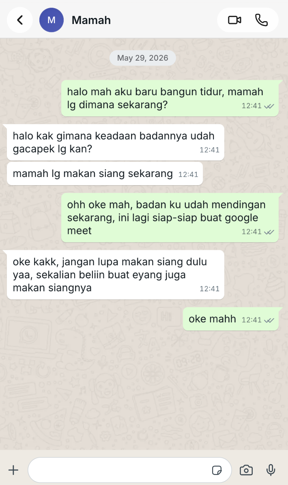

## Kompetensi target

Melakukan personal conversation dengan listening, clarity, boundary, dan relationship awareness.

## Evidence wajib

- Transcript atau catatan percakapan.
- Evidence listening dan response.
- Analisis relationship state sebelum dan sesudah.

::: {.callout-tip title="Lihat contoh pengisian"}
[Buka contoh fiktif Minggu 3](../examples/week-03.qmd) untuk melihat tingkat kekonkretan evidence dan analisis. Jangan menyalin contoh sebagai evidence pribadi.
:::

::: {.callout-note title="Cara mengisi portofolio ini"}
Pilih satu percakapan nyata atau role-play dengan orang yang memiliki hubungan dengan Anda. Fokuskan percakapan pada satu kebutuhan, batas, permintaan, atau upaya memperbaiki hubungan. Ganti semua teks dalam tanda kurung siku `[seperti ini]` dengan pengalaman Anda sendiri.

Urutan kerja:

1. Catat relationship state sebelum percakapan: tingkat kepercayaan, ketegangan, dan pola komunikasi.
2. Tentukan objective yang spesifik dan tidak menyalahkan orang lain.
3. Gunakan observasi konkret, dengarkan respons partner, lalu parafrasekan pemahamannya.
4. Sampaikan kebutuhan dan boundary dengan jelas, kemudian ajukan request yang dapat dinegosiasikan.
5. Jika ada kesalahan komunikasi, lakukan repair melalui pengakuan dan perbaikan yang spesifik.
6. Catat agreement dan lakukan check-in setelah beberapa hari.
7. Isi template umum di bagian bawah berdasarkan bukti, bukan hanya kesan pribadi.

Gunakan nama samaran atau inisial. Jangan merekam percakapan sensitif tanpa izin. Jika percakapan berisiko menimbulkan bahaya atau konflik serius, pilih role-play atau konsultasikan dengan pihak yang tepat.
:::

## Konteks dan relationship state

**Person/partner:** Keluarga saya; nama dan identitas tidak dicantumkan.

**Situasi pemicu:** Pada 29 Mei 2026 sekitar pukul 07.00, setelah mengerjakan Tugas Besar Algoritma Pemrograman 1 sepanjang malam sampai sekitar pukul 06.30, saya menolak ikut perjalanan keluarga karena perlu tidur dan memulihkan kondisi.

**Pola komunikasi sebelum percakapan:** Pola komunikasi saya dengan orang tua biasa saja, seperti komunikasi sehari-hari antara anak dan orang tua. Tidak ada konflik khusus yang dilaporkan sebelum percakapan ini.

**State sebelum percakapan:** Saya berada dalam kondisi sangat lelah setelah begadang mengerjakan tubes dan membutuhkan tidur. Tingkat ketegangan biasa saja karena percakapan ini merupakan percakapan normal sehari-hari, bukan konflik. Orang tua saya kemudian menunjukkan keprihatinan terhadap kondisi tersebut.

**Objective saya:** Menyampaikan bahwa saya tidak dapat ikut perjalanan dengan jelas dan sopan, agar keluarga dapat tetap berangkat tanpa menunggu saya dan memahami bahwa keputusan tersebut berkaitan dengan kondisi fisik setelah deadline.

**Hal yang perlu saya jaga:** Hubungan baik dengan keluarga, penyampaian yang hormat, kejelasan rencana keberangkatan, dan kebutuhan istirahat setelah bekerja sepanjang malam.

## Rencana komunikasi

**Observasi tanpa label:** “Saya baru menyelesaikan tubes sekitar pukul 06.30 setelah mengerjakannya sepanjang malam, sementara perjalanan keluarga berangkat pukul 07.00.”

**Kebutuhan saya:** Saya membutuhkan tidur dan pemulihan fisik agar tidak memaksakan diri setelah menyelesaikan deadline.

**Boundary:** Saya tidak ikut perjalanan pukul 07.00 setelah bekerja semalaman; saya akan tetap di tempat untuk tidur dan memulihkan kondisi.

**Request:** Saya menyampaikan bahwa saya tidak dapat ikut pergi dan membutuhkan istirahat. Saya tidak mengajukan permintaan tambahan secara eksplisit karena sedang sangat kelelahan.

**Rencana repair bila diperlukan:** Jika penyampaian saya terdengar terlalu singkat atau membuat keluarga merasa diabaikan, saya akan mengakui hal tersebut, menjelaskan kondisi saya tanpa menyalahkan keluarga, dan menawarkan waktu untuk berkomunikasi setelah saya cukup beristirahat.

## Potongan transcript atau catatan percakapan

Tulis bagian yang menunjukkan observasi, listening, paraphrase, kebutuhan, boundary, request, respons partner, dan repair. Jika menggunakan catatan ringkas, beri label `catatan`, bukan transcript verbatim.

> **Ringkasan percakapan:**  
> **Saya:** “Mah, Pah, kayaknya aku enggak bisa ikut pergi deh, karena aku kecapekan mengerjakan tubes semalaman.”  \
> **Orang tua:** “Ya sudah, kalau kamu kecapekan, istirahat di rumah saja sekalian menemani Eyang.”  \
> Setelah itu, saya berpamitan kepada orang tua dan pergi ke kamar untuk tidur.

**Bukti listening:** Saya tidak mengajukan pertanyaan atau melakukan paraphrase karena benar-benar kelelahan. Namun, saya mendengar respons orang tua yang menunjukkan bahwa mereka memahami kondisi saya dan merasa prihatin.

**Paraphrase:** Screenshot percakapan menunjukkan respons dan penerimaan orang tua, tetapi saya belum merangkum ulang respons mereka dengan kalimat konfirmasi seperti “Jadi, Mama memahami saya perlu tidur setelah menyelesaikan tubes, apakah benar?” Karena itu, check-in sudah memiliki bukti, sedangkan paraphrase eksplisit masih perlu dilakukan.

**Bukti boundary:** Saya menyampaikan bahwa saya tidak ikut perjalanan pukul 07.00 karena baru menyelesaikan tubes dan perlu tidur.

**Bukti request:** Saya tidak mengajukan request terpisah. Saya menyampaikan kebutuhan dan batas secara langsung melalui kalimat bahwa saya tidak bisa ikut pergi karena kelelahan. Orang tua kemudian mengusulkan agar saya beristirahat di rumah dan menemani Eyang.

**Bukti repair:** Tidak ada repair yang dilakukan karena tidak ada kesalahan komunikasi atau konflik yang dilaporkan dalam percakapan ini. Namun, saya belum melakukan check-in lanjutan untuk memastikan apakah orang tua masih memiliki kebutuhan atau perasaan yang perlu dibicarakan.

## Agreement dan relationship outcome

**Agreement yang dicapai:** Saya tidak ikut pergi dan beristirahat di rumah, sekaligus menemani Eyang. Orang tua memahami keputusan tersebut dan tidak memaksa saya ikut perjalanan.

**Hal yang belum disepakati:** Tidak ada perbedaan atau konflik yang dilaporkan. Paraphrase eksplisit atas respons Mama belum dilakukan, sehingga pemahaman bersama belum diuji dengan teknik tersebut.

**Check-in:** Setelah bangun, saya menghubungi Mama pada 29 Mei 2026 pukul 12.41. Mama menanyakan kondisi badan saya, memberi tahu bahwa ia sedang makan siang, dan mengingatkan saya makan serta membelikan makanan untuk Eyang. Saya menjawab bahwa kondisi badan sudah membaik dan saya sedang bersiap mengikuti Google Meet. Screenshot check-in dilampirkan pada bagian evidence.

**Tindak lanjut:** Check-in sudah dilakukan pada pukul 12.41 dan dibuktikan dengan screenshot. Tindak lanjut berikutnya adalah melakukan paraphrase eksplisit dan meminta konfirmasi Mama atas rangkuman tersebut.

**State setelah percakapan:** Saya dapat beristirahat di kamar dan menemani Eyang. Setelah bangun, saya melanjutkan review tubes dan bersiap mengikuti Welcoming Party GDGoC secara daring. Berdasarkan respons langsung orang tua, percakapan berakhir tanpa paksaan atau konflik yang dilaporkan. Perubahan jangka panjang pada kepercayaan dan ketegangan hubungan belum dapat disimpulkan.

**Respons partner setelah percakapan:** Orang tua langsung memahami kondisi saya, menunjukkan keprihatinan karena saya kelelahan, dan menyarankan agar saya beristirahat di rumah sambil menemani Eyang.

## Evidence dan refleksi

- [x] Transcript atau catatan percakapan yang dianonimkan.
- [ ] Screenshot chat koordinasi teknis kelompok (bukan evidence paraphrase/check-in personal).
- [x] Bukti agreement, berupa respons penerimaan orang tua pada screenshot.
- [ ] Catatan observer jika menggunakan role-play.
- [x] Check-in setelah beristirahat.
- [x] Catatan perbandingan relationship state sebelum dan sesudah berdasarkan respons langsung orang tua.
- [ ] Bukti lain: belum dilampirkan.

::: {.evidence-block}
{width=85%}

Screenshot menunjukkan saya menyampaikan tidak ikut perjalanan karena kelelahan setelah mengerjakan tugas semalaman. Mama menerima keputusan tersebut dan menyarankan saya tidur serta beristirahat di rumah.

{width=85%}

Screenshot menunjukkan check-in pada pukul 12.41 setelah saya bangun. Mama menanyakan kondisi saya dan mengingatkan makan serta membelikan makanan untuk Eyang. Saya memberi kabar bahwa kondisi membaik dan saya bersiap mengikuti Google Meet.

{width=85%}

Screenshot ini merupakan artifact eksternal dari percakapan teknis kelompok. Isinya menunjukkan permintaan pengujian lokal, konfirmasi bahwa masalah sudah diperbaiki, serta usulan penambahan algoritma. Artifact ini hanya menjadi bukti tambahan dan bukan bukti paraphrase/check-in personal.
:::

**Template artifact paraphrase yang masih perlu dilakukan:**

| Bagian | Catatan terverifikasi |
|---|---|
| Waktu dan medium paraphrase | `[tanggal, waktu, tatap muka atau pesan teks]` |
| Respons partner yang dirangkum | `[ringkas atau kutip dengan izin; gunakan inisial]` |
| Paraphrase saya | `[ringkas kembali maksud partner]` |
| Konfirmasi partner | `[catat apakah partner menyatakan rangkuman tepat]` |

Evidence yang sudah tersedia menunjukkan boundary, respons penerimaan, dan check-in setelah beristirahat. Artifact yang masih dibutuhkan untuk memenuhi seluruh revisi assessor adalah pesan paraphrase eksplisit yang dirangkum kembali dan dikonfirmasi oleh Mama.

**Apa yang berhasil:** Saya menetapkan batas dengan menghubungkan keputusan tidak ikut perjalanan pada fakta yang jelas: tubes baru selesai setelah bekerja semalaman dan saya membutuhkan tidur.

**Apa yang perlu diperbaiki:** Karena kondisi saya sangat lelah, saya tidak sempat mengajukan pertanyaan atau melakukan paraphrase. Dalam situasi serupa, setelah kondisi lebih tenang saya dapat melakukan check-in untuk memastikan kebutuhan dan perasaan keluarga juga terdengar.

**Next practice:** Dalam percakapan berikutnya, saya akan menyebutkan observasi, kebutuhan, batas, dan permintaan secara berurutan. Sebelum mengakhiri percakapan, saya akan menanyakan apakah partner memahami alasan saya, melakukan paraphrase atas jawabannya, lalu menjadwalkan check-in setelah saya beristirahat. Bukti baru hanya akan ditandai tersedia setelah catatan atau pesan tersebut benar-benar dibuat.

Pada bagian `Analisis komunikasi` di bawah, gunakan `Person & character` untuk menjelaskan kebutuhan kedua pihak, `Objective & state` untuk membandingkan kondisi sebelum dan sesudah, `Repertoire & language` untuk menganalisis observasi/paraphrase/boundary/request, `Response & adaptation` untuk menjelaskan penyesuaian Anda, dan `Agreement, Action & Relationship` untuk menjelaskan hasil serta check-in.

## Penggunaan AI dan privasi

AI digunakan untuk membantu menata catatan percakapan ke dalam struktur portfolio. Fakta percakapan, waktu, kondisi saya, dan respons orang tua berasal dari catatan saya sendiri. Saya memeriksa kembali urutan kejadian, menghapus identitas pribadi, dan tidak memasukkan isi percakapan sensitif selain ringkasan yang relevan dengan tugas. Saya tetap bertanggung jawab membedakan observasi, kebutuhan, boundary, request, response, dan relationship outcome.

## Analisis komunikasi sementara

| Elemen | Evidence dan analisis |
|---|---|
| Person & character | Saya bertindak sebagai anggota keluarga yang perlu menjaga hubungan, sekaligus mahasiswa yang bertanggung jawab terhadap deadline dan kondisi fisik. Orang tua berperan sebagai pihak yang memperhatikan kondisi saya dan menerima kebutuhan saya untuk beristirahat. |
| Objective & state | Objective saya adalah menyelesaikan tubes dan menyampaikan ketidakikutsertaan dengan jelas. State awal: tugas selesai setelah bekerja semalaman; state setelahnya: saya tidak ikut perjalanan dan perlu tidur. |
| Repertoire & language | Saya menggunakan bahasa langsung, santai, dan sopan: “Mah, Pah, kayaknya aku enggak bisa ikut pergi deh, karena aku kecapekan mengerjakan tubes semalaman.” Saya tidak menggunakan pertanyaan atau paraphrase dalam percakapan asli karena kelelahan; praktik berikutnya perlu menguji pemahaman partner melalui pertanyaan dan paraphrase. |
| Response & adaptation | Saya memilih tidak ikut perjalanan setelah deadline, tetapi tetap menghadiri kegiatan GDGoC pukul 13.00. Keputusan menghadiri kegiatan itu perlu dievaluasi karena saya belum tidur. |
| Agreement, Action & Relationship | Saya memberi tahu orang tua, berpamitan, lalu tidur di kamar dan menemani Eyang. Orang tua menerima keputusan tersebut tanpa konflik yang dilaporkan. Check-in lanjutan belum tercatat, sehingga dampak jangka panjang pada hubungan belum dapat dinilai. |

**Informasi yang masih diperlukan untuk menuntaskan Minggu 3:** hasil check-in khusus dengan orang tua setelah saya tidur, paraphrase atas respons mereka, dan tingkat ketegangan sesudah percakapan jika ingin dilaporkan dengan skor. Transcript lengkap tidak wajib karena ringkasan percakapan sudah tersedia.

## Self-assessment sementara

| Dimensi | Skor 1–4 | Evidence singkat |
|---|---:|---|
| Person & Character | 4 | Saya mengenali kebutuhan saya untuk beristirahat dan kebutuhan keluarga untuk mendapat kejelasan rencana. |
| Objective & State | 4 | Saya menyampaikan batas secara spesifik setelah menyelesaikan tubes dan menjelaskan kondisi fisik saya. |
| Repertoire, Language & AI | 3 | Saya memakai bahasa langsung, santai, dan sopan, tetapi tidak sempat melakukan pertanyaan atau paraphrase karena kelelahan. |
| Response & Adaptation | 4 | Saya memilih tidak ikut perjalanan, beristirahat, dan melakukan check-in setelah bangun. |
| Agreement, Action & Relationship | 3 | Screenshot memverifikasi penerimaan boundary dan check-in. |

**Total sementara:** 18 / 20


